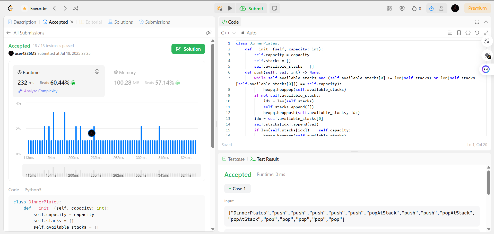
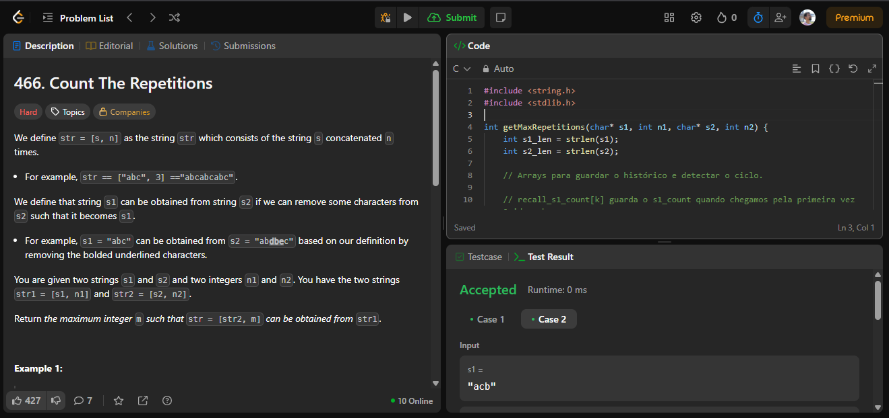
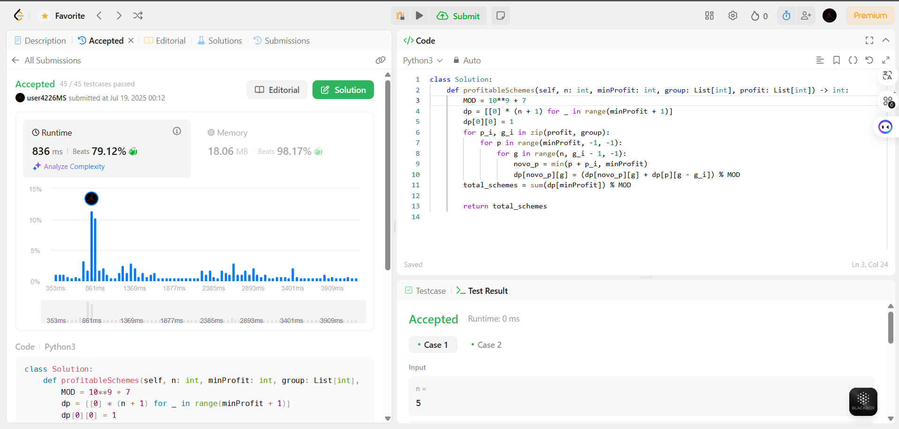
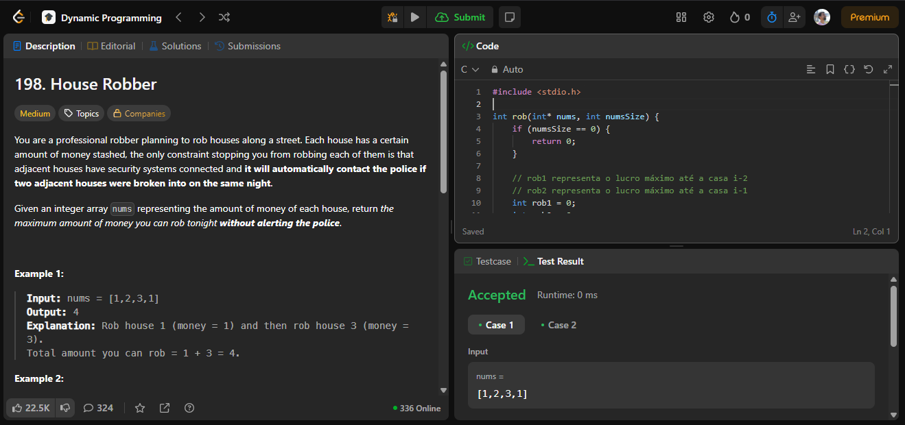

# Exercícios do Leetcode sobre Programação Dinâmica

**Conteúdo da Disciplina**: Programação Dinâmica 

## Alunos

|Matrícula | Aluno |
| -- | -- |
| 20/0059980 | Pedro Miguel Martins de Oliveira dos Santos |
| 21/1062910 |  Daniel Nunes Duarte |

## Sobre

Neste projeto resolvemos duas questões do tema Programação Dinâmica:

- A primeira questão é a 1172, disponível em [Questão 1172](https://leetcode.com/problems/dinner-plate-stacks/description/?envType=problem-list-v2&envId=ozm4un4c). Ela trata sobre o gerenciamento de pilhas de pratos, resolvida em Python.
- A segunda questão é a 466, disponível em [Questão 466](https://leetcode.com/problems/count-the-repetitions/description/). Ela trata sobre a contagem de repetições entre duas string e foi resolvida em C.
- A terceira questão é a 879, disponível em [Questão 879](https://leetcode.com/problems/profitable-schemes/description/?envType=problem-list-v2&envId=ozm4un4c). O desafio consiste em encontrar o número de esquemas lucrativos possíveis, resolvida em Python.
- A quarta questão é a 198, disponível em [Questão 198](https://leetcode.com/problems/house-robber/description/). Ela trata sobre um ladrão de casas e o dilema de roubar as melhores casas sem ser pego pela polícia e foi resolvida em C.

## Screenshots

### Questão 1172

#### Hard

---

### Questão 466

#### Hard

---

### Questão 879

#### Medium

---

### Questão 198

#### Medium

---

## Instalação

**Linguagem**: C e Python 

## Uso

1. Para utilizar as soluções, basta encontrar o código da questão desejada no repositório e copiar.
2. Abra o site da questão referente no LeetCode e cole o código no campo "code" dentro da página.
3. Para realizar a execução e teste, aperte o botão "play" na página ao lado do botão "submit".

Obs.: Necessário estar logado na página LeetCode.
